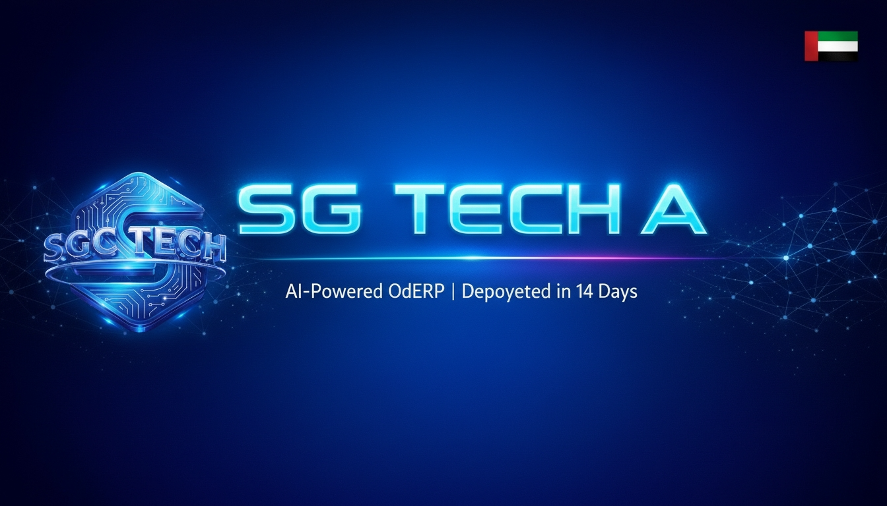

=============================================
SGC TECH AI — Premium Glassmorphism Website Theme
=============================================

A production-ready **Odoo 19** website theme for
`SGC TECH AI <https://sgctech.ai>`_ — deep-space dark UI, glassmorphism
cards, and GPU-accelerated canvas animations.

.. contents:: Table of Contents
   :depth: 2

Features
========

- **Deep-space dark UI** — #060E1A → #0A1628 colour palette
- **Glassmorphism** — ``backdrop-filter: blur`` cards throughout
- **Canvas particle network** — 90-particle interactive hero background
- **Scroll-reveal animations** — IntersectionObserver (fade, slide, scale)
- **Animated counters** — easeOutQuart easing
- **Magnetic CTA buttons** — pointer-tracking transform effect
- **Typewriter effect** — cycles through configurable phrases
- **Parallax orbs** — floating decorative glows
- **Tech stack ticker** — infinite horizontal scroll
- **Mobile-first responsive** — 480 px → 1400 px breakpoints
- **Google Fonts** — Orbitron + Inter + Share Tech Mono (loaded via ``<link>``)
- **UAE / MENA optimised** — AED pricing, VAT-ready, Arabic RTL support

Module Structure
================

.. code-block:: text

   website_sgctech_ai/
   ├── __init__.py
   ├── __manifest__.py
   ├── .gitignore
   ├── README.rst
   ├── controllers/
   │   ├── __init__.py
   │   └── main.py              # Website controller + /sgctech/stats JSON
   ├── models/
   │   └── __init__.py          # Empty — no custom models
   ├── security/
   │   └── ir.model.access.csv  # Empty — no custom models
   ├── static/
   │   ├── description/
   │   │   ├── banner.png       # 1344×768 App Store banner
   │   │   ├── icon.png         # 128×128 module icon
   │   │   └── icon.svg         # SVG source for icon
   │   └── src/
   │       ├── css/
   │       │   ├── 01_variables.css   # Design tokens (:root CSS variables)
   │       │   ├── 02_base.css        # Global base & typography
   │       │   ├── 03_layout.css      # Navbar & footer
   │       │   ├── 04_hero.css        # Hero section
   │       │   ├── 05_sections.css    # All page sections
   │       │   ├── 06_components.css  # Buttons & reusable components
   │       │   ├── 07_animations.css  # Keyframes & scroll-reveal utilities
   │       │   └── 08_responsive.css  # Media queries
   │       ├── img/                   # Theme images (AI-generated, 8K quality)
   │       └── js/
   │           └── sgctech.js         # All JS: particles, typewriter, counters
   └── views/
       ├── website_templates.xml  # Layout overrides (body class, fonts, nav, footer)
       ├── homepage.xml           # Full 10-section homepage at /sgctech-home
       └── snippets.xml           # 5 drag-and-drop Website Builder snippets

Installation
============

1. Copy the ``website_sgctech_ai`` directory into your Odoo addons path
2. Restart Odoo (``docker compose restart web`` or service restart)
3. Enable **Developer Mode** in Settings
4. Go to **Apps** → Update App List → search "SGC" → Install
5. Navigate to **Website** → **Configuration** → **Settings**
6. Set **Homepage URL** to ``/sgctech-home``

Or install via CLI::

   odoo -d <dbname> -i website_sgctech_ai --db_host db \
        --db_user odoo --db_password odoo \
        --no-http --stop-after-init

Note: the module depends on ``website_sale`` because the homepage and footer
link directly to the package store at ``/shop``.

Homepage
========

The branded homepage is accessible at:

``/sgctech-home``

Sections
--------

1. **Hero** — particle canvas, typewriter headline, floating badges
2. **Trust Bar** — social proof strip (Odoo Partner, AI, UAE VAT, etc.)
3. **Industries** — 8 industry cards (Real Estate, Construction, …)
4. **Why Us** — 6 glassmorphism feature cards
5. **Stats** — animated counter row
6. **Pricing** — 3-tier pricing cards (Starter / Professional / Enterprise)
7. **Testimonials** — 3-card testimonial grid
8. **Tech Stack** — infinite-scroll technology ticker
9. **CTA Banner** — call-to-action with animated lines
10. **Footer** — multi-column dark footer with social links

Website Builder Snippets
========================

Five drag-and-drop snippets are registered under the **SGC TECH AI**
panel in the Website Builder:

- **SGC Glass Cards** — 6-card glassmorphism feature row
- **SGC Stats Counter** — animated 4-stat counter bar
- **SGC CTA Banner** — gradient CTA section
- **SGC Pricing Cards** — 3-tier pricing grid
- **SGC Testimonials** — 3-card testimonial layout

Configuration
=============

Design Tokens
-------------

All colours, spacing, typography, and glassmorphism values are defined as
CSS custom properties in ``static/src/css/01_variables.css``.  Edit the
``:root`` block to re-theme without touching any other file.

Google Fonts
------------

Fonts are loaded via ``<link>`` tags injected into ``<head>`` by the
``sgctech_meta`` template in ``views/website_templates.xml``.  This avoids
the Odoo CSS-bundle ``@import`` limitation (imports must be at position 0
of the bundled stylesheet).

Technical Notes
===============

- ``sgc-theme`` class injected onto ``#wrapwrap`` using attribute extension on
   ``website.layout`` so core Odoo classes stay intact in Odoo 19
- All CSS scoped to ``#wrapwrap`` to prevent backend interference
- JS is registered in ``web.assets_frontend`` with an Odoo module wrapper and
   a DOM-ready guard, so it safely no-ops on non-theme pages
- Assets are registered in ``web.assets_frontend`` for standard Odoo 19
   bundling and minification

Credits
=======

:Author: SGC TECH AI — Scholarix Global Consultants
:Website: https://sgctech.ai
:Support: hello@sgctech.ai
:License: LGPL-3
